https://www.youtube.com/watch?v=9QUtcfyBFhE&list=PLaYBfUc8SG7W4cTZprVWjbtwrottWuk8c

* * *

# [https://www2.fct.unesp.br/docentes/carto/galo/web/gnuplot/pdf/2024\_Galo\_Gnuplot\_Tutorial.pdf](https://www2.fct.unesp.br/docentes/carto/galo/web/gnuplot/pdf/2024_Galo_Gnuplot_Tutorial.pdf)

# plot

comando basico usado para fazer a visualização `plot`

plot sin(x)

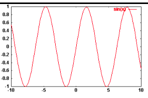

plot log(x)

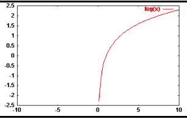

* * *

# Ativação da grade

`set grid` antes do plot.

Para desativar : `set nogrid`

```
set grid
plot log(x)
```

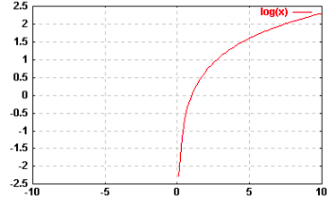

* * *

# Coordenadas x,y,z(3d)

`set xrange`

`set yrange`

`set zrange`

```
set xrange [0:3]
plot log(x)
 OU
plot [0:3] log(x)
```

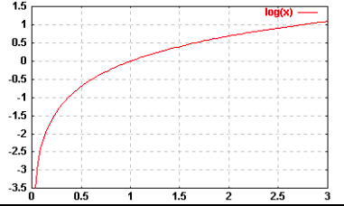

* * *

# Mais de uma visualização

`, ou rep`

```
set grid
plot sin(x),\
cos(x/3),\
x/14-1
	OU
set grid
plot(x)
rep cos(x/3)
rep x/14-1
```

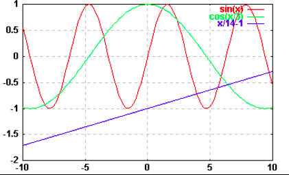

* * *

# Modificação de atributos

# Cor, tipos de pontos e linhas

`test`

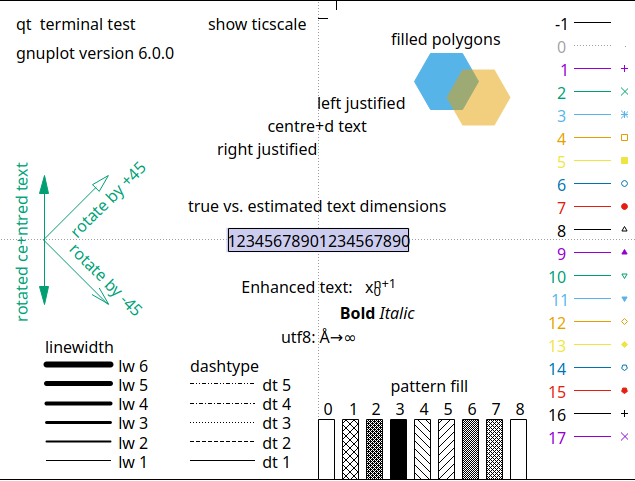

# Linhas

```
plot sin(x/2) ...
with points
with lines
with linespoints
with dots
with impulses
```

# Cores

`lc`

```
plot sin(x/2) with points/lines/linespoints/dots/impulses...
lc 3 = azul
lc 5 = amarelo
lc 1 = roxo
lc 8 = preto
lc 9 = ultra-roxo
```

* * *

# Entidades pontuais

`pt`

```
plot [0:pi/2] sin(x/2) with points lc 10 pt 6
rep cos(4*x) with impulses lc 3
```

observação: primeira linha tem o numero **10 representando a cor** e **6 representa o tipo do ponto**

Primeiro numero = lc → cor

Segundo numero = pt →tipo de ponto

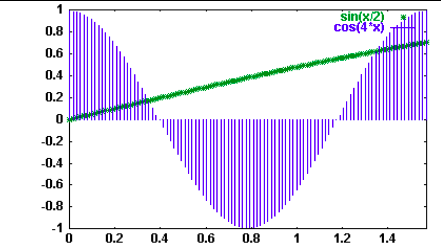

* * *

# Unica função usando diferentes opções

```
OPÇAO 1:
set xrange [-2*pi:2*pi]
plot sin(x/2)

OPÇÃO 2:
set xrange [-2*pi: 2*pi]
f(x)=sin(x/2)
plot f(x)

OPÇÃO 3:
set xrange [-2*pi:2*pi]
f(x,b)=sin(x/b)
plot f(x,2)

OPÇÃO 4:
set xrange [-2*pi:2*pi]
f(x)=sin(x*a)
plot f(x), a=0.5

OPÇÃO 5:
set xrange [-2*pi:2*pi]
f(x,a)=sin(a*x)
plot f(x,0.5)
```

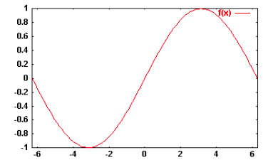

* * *

# Ver varias funç~ões simultaneamente no mesmo dominio

É feito um `script`

```
set xrange [-10:10]
f1(x)=180
f2(x)=13*x-200
f3(x)=4-2*x*x-3*x
f4(x)=0.5*x*x*x-34*x+2*x*x-22
plot f1(x)
rep f2(x)
rep f3(x)
rep f4(x)
```

Ou , uma opção mais geral para visualizar os polinomios seria escrever um polinomio de grau 3.

`y = f(x) = a + bx + cx² + dx³`

onde a,b,c,d são constantes.

```
reset
set xrange[-10:10]
f(x,a,b,c,d)=a+b*x+c*x**2+d*x**3
```

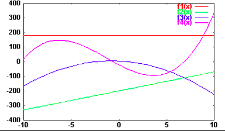

* * *

# Leitura e visualização de dados a partir de arquivos/texto/legenda

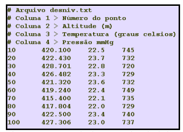

```
reset
plot "desniv.txt"
```

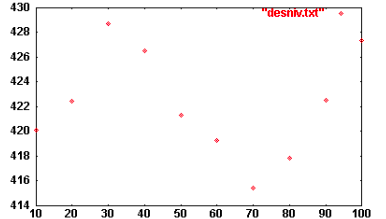

É possivel explicitar as colunas que se quer utilizar, usando a opção `string`

```
reset
plot "desniv.txt" using 1:2
OU
reset
plot "desniv.txt" using ($1) : ($2)
```

* * *

# Inserção de titulo e texto nos eixos x e y

```
set title "texto que corresponde ao titulo"
set xlabel "texto que corresponde a abscissa"
set ylabel "texto que corresponde a ordenada"
```

```
reset
set grid
set xrange[0:25]
set title "Função Parabolica \n Teste 1"
set xlabel "X - Tempo (s)"
set ylabel "Y - Aceleração (m/s2)"
f(x)=0.1*x**2-5*x+20
plot f(x) with lines lc 8
```

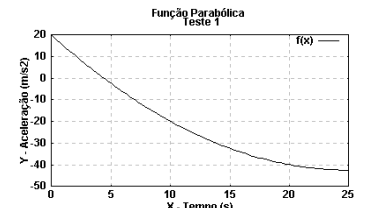

# Modificação do espaçamento da grade

```
set xtics ix
set ytics iy
```

```
reset
set grid
set xtics 2
seet ytics 5
set xrange [0:25]
set title "Função Parabolica \n teste 1"
set xlabel "x - tempo (s)"
set ylabel "y - aceleração (m/s2)"
f(x)=0.1*x**2-5*x+20
plot f(x) with lines lc 8
```

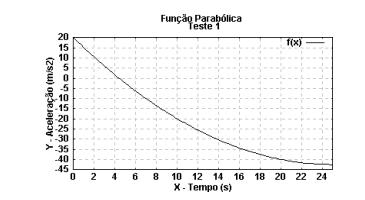

```
...
set grid
set xtics 2
set mxtics 2
set ytics 5
set mytics 2
set xrange [0:25] ...
```

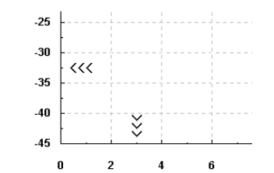

# Modificação da legenda

opção t seguido do texto a ser escrito , na **mesma linha** do plot ou rep

```
reset
set grid
set xtics 2
set mxtics 2
set tics 40
set mytics 2
set xrange[0:25]
set title "Função Parabolica \n Teste 1"
set xlabel "X - Tempo (s)"
set ylabel "Y - Aceleração (m/s2)"
f(x,a,b,c)=a+b*x+c*x**2
plot f(x,120,-5,0.1) t"Função 1" with points lc 3 pt 5
rep f(x,80,+10,-0.15) t"Função 2" with lines lc 8
```

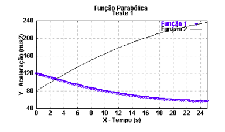

# Modificar localização da legenda

```
set key left bootom (canto inferior esquerdo)
set key right bottom (canto inferior direito)
set key left top (canto superior esquerdo)
set key right top (canto superior direito)
```

* * *

# Criação de Scripts em arquivos

Escrever o script em arquivo e depois carregar no aplicativo

1.  abrir aplicativo
    
2.  load “nome.gnu”
    

* * *

# Operador ternário

```
<Expressao E> ? < Opção A> : < Opção B >
```

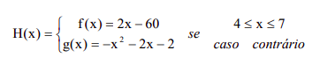

```
reset
set xtics 1
set grid
set xrange [0:10]

f(x)=2*x-60
g(x)=-x**2+2*x-2
f(x)=(4<=x && x<=7) ? f(x):g(x)

plot f(x) t "Função Composta"
Pause -1 "Fechar ?"
```

* * *

# Superficies

É uma visualização de curvas planas . splot

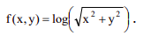

```
reset
set grid
set format z "%4.2f"
f(x,y)=log(sqrt ( x*x + y*y) )
splot f(x,y)
```

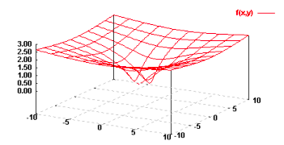

* * *

# Acentuação em portugues

```
set encoding utf8
```

qualquer coisa a mais → help encoding